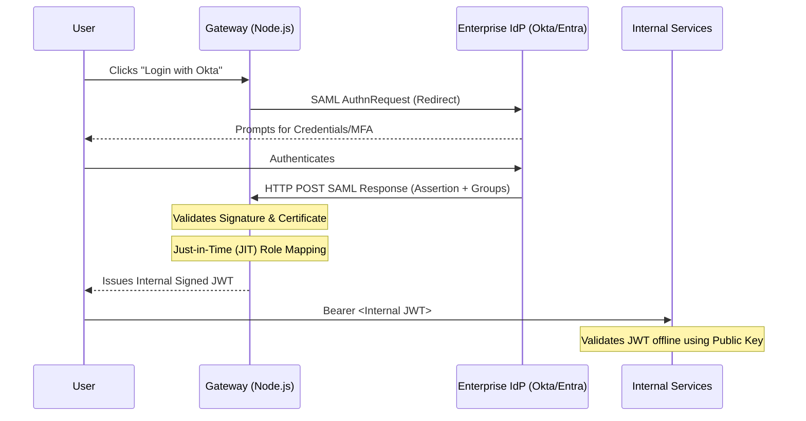

# Enterprise Authentication Gateway

A robust, enterprise B2B Authentication and Authorization Gateway utilizing Passport.js to synthesize SAML 2.0 Identity Provider assertions into unified decoupled JSON Web Tokens for internal microservices.

## SSO & Provisioning Flow

## Core Implementation Features

### Dynamically Generated Strategies
In high-scale B2B systems, you cannot hardcode certificates. The gateway uses the AWS SDK `SecretsManagerClient` to fetch Tenant-specific SAML parameters (EntryPoint, Cert, IssuerURI) on the fly, dynamically constructing the Passport strategy.

### Just-in-Time (JIT) Provisioning
The `passport-saml` profile extraction maps external enterprise groups directly to internal Custom Roles (e.g., `Okta "Developers"` -> `Internal "Admin"`). This allows Enterprise IT to manage roles without touching our database.

### SCIM 2.0 Directory Sync
Contains a mock interface `/scim/v2/Users` designed to accept payload requests from IdPs when an Administrator adds or removes a user in their dashboard, seamlessly mirroring the Directory state and invalidating tokens upon deprovisioning.
