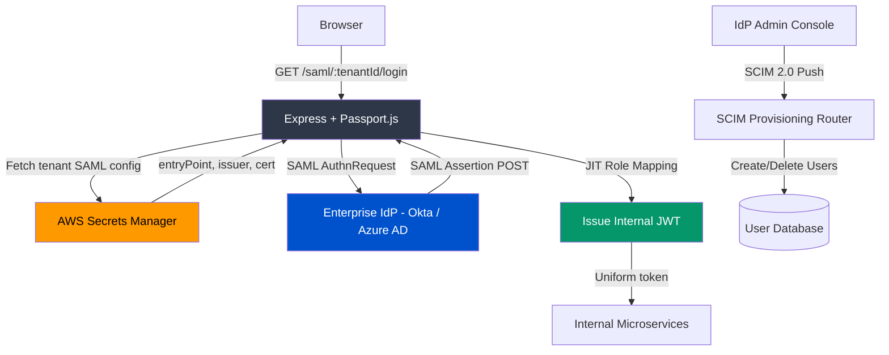

# Enterprise Auth Gateway

A B2B SSO gateway. Each customer's SAML 2.0 assertions become one uniform internal JWT, SCIM 2.0 handles user provisioning, and per-tenant configuration is resolved from AWS Secrets Manager at runtime.

Code: [github.com/sudhanshu1402/enterprise-auth-stack](https://github.com/sudhanshu1402/enterprise-auth-stack)

## The problem

Every enterprise customer arrives with a different identity provider: Okta, Azure AD, OneLogin, each with its own entry point, its own signing certificate and its own idea of what an attribute is called. Two things go wrong if you take that shape into your codebase.

The first is configuration sprawl: a tenant config per customer, checked in, redeployed whenever someone rotates a certificate. The second is worse. Certificates in a repository or a database are a rotation problem, and rotation problems are found by a customer at 9am on a Monday.

So the gateway treats tenant identity config as runtime data, and treats SAML as a detail that stops at its own boundary. Downstream services receive one token shape and never learn what an assertion is.

## Architecture

```mermaid
graph TB
    Browser[Browser] -->|GET /saml/:tenantId/login| API[Express + Passport.js]
    API -->|Fetch tenant SAML config| SM[AWS Secrets Manager]
    SM -->|entryPoint, issuer, cert| API
    API -->|SAML AuthnRequest| IdP[Enterprise IdP - Okta / Azure AD]
    IdP -->|SAML Assertion POST| API
    API -->|JIT Role Mapping| JWT[Issue Internal JWT]
    JWT -->|Uniform token| MS[Internal Microservices]

    IdP2[IdP Admin Console] -->|SCIM 2.0 Push| SCIM[SCIM Provisioning Router]
    SCIM -->|Create/Delete Users| DB[(User Database)]

    style API fill:#2d3748,color:#fff
    style SM fill:#ff9900,color:#000
    style IdP fill:#0052cc,color:#fff
    style JWT fill:#059669,color:#fff
```

## One login, step by step

1. Browser hits `/api/auth/saml/:tenantId/login`.
2. `getTenantConfig` pulls that tenant's entry point, issuer and certificate from Secrets Manager.
3. `createTenantStrategy` builds a Passport SAML strategy from that config, for this request only.
4. Passport redirects to the IdP with an AuthnRequest.
5. The IdP POSTs a signed assertion to the callback. The signature is verified against the stored certificate.
6. `mapGroupsToRole` turns IdP group attributes into an internal role: `Admin` becomes `admin`, everything else becomes `member`.
7. A one-hour JWT is issued, scoped to tenant and role, and that's the only credential any internal service sees.

The tenant id is in the URL, so the config lookup happens before any cryptography. A wrong or unknown tenant fails before an assertion is ever parsed.

## The decisions, and what they cost

**Strategies are built per request and never cached.** This is the expensive-looking choice and the deliberate one. A cached strategy holds a certificate; when a customer rotates theirs, every login keeps failing against the stale one until something evicts it, and "something" is usually a redeploy during an incident. Rebuilding per request costs one Secrets Manager call per login and makes rotation take effect on the next attempt. That's the right trade until login volume makes the call cost visible, at which point a short TTL cache with explicit invalidation is the upgrade, not an unbounded one.

**JIT role mapping instead of pre-provisioning.** Roles are derived from the assertion at login, so a new hire in the customer's directory can sign in without anyone touching this system first. The cost is that group-to-role mapping logic lives here and has to stay in step with what customers actually name their groups.

**Dev fallbacks that fail closed.** There's a mock IdP config for local development, and under `NODE_ENV=production` it's disabled: a missing tenant secret returns 500 rather than quietly authenticating someone against a fake provider. SCIM refuses to boot without `SCIM_BEARER_TOKEN` instead of defaulting to a placeholder. A fallback that's convenient in development and dangerous in production is worth an explicit environment check.

**SAML terminates at the gateway.** Internal services validate a JWT and nothing else. Adding OIDC later means one more strategy behind the same boundary, not a change to every consumer.

## SCIM provisioning

Bearer-secured create, read, list, PATCH and delete. PATCH is where the real work is: `extractActiveFromPatch` parses the activate and deactivate operations that IdPs actually send, because deprovisioning arrives as a patch on `active`, not as a delete. A duplicate `userName` returns 409 with `scimType: uniqueness`, which is the specific error shape SCIM clients know how to handle.

## Failure modes

| What breaks | What happens |
|---|---|
| Customer rotates a certificate | next login picks up the new one, no deploy |
| Tenant secret missing in production | 500, no authentication against a fallback |
| `SCIM_BEARER_TOKEN` unset | SCIM refuses to start |
| Duplicate SCIM `userName` | 409 with `scimType: uniqueness` |
| Unsigned or wrongly signed assertion | rejected at signature verification |
| Secrets Manager unavailable | logins fail closed; there's no cached config to fall back to |

That last row is the cost of not caching, stated plainly.

## Where this stops working

- **`passport-saml` is deprecated.** The move to `@node-saml/passport-saml` hasn't happened.
- **SAML only.** Most modern IdPs would rather speak OIDC.
- **HS256 with a shared secret.** RS256 with public key distribution is what lets services verify without holding the signing key.
- **No Secrets Manager caching**, which is the same decision as above read as a cost rather than a benefit.
- **No authentication audit log.** This is the first thing a compliance review asks for.
- **Synchronous SCIM.** A thousand-user directory sync will feel it.
- **In-memory user store.** It's a reference implementation of the wiring, not a hosted product.

## Test surface

Six suites, no network and no AWS credentials, since the SDK is mocked. They cover role mapping, per-request strategy construction, the JWT claim shape, the SCIM store including deprovision parsing, `getTenantConfig` across both production and development behaviour, and a check that the OpenAPI document matches the routes actually served, so documenting an endpoint that doesn't exist fails the build.
