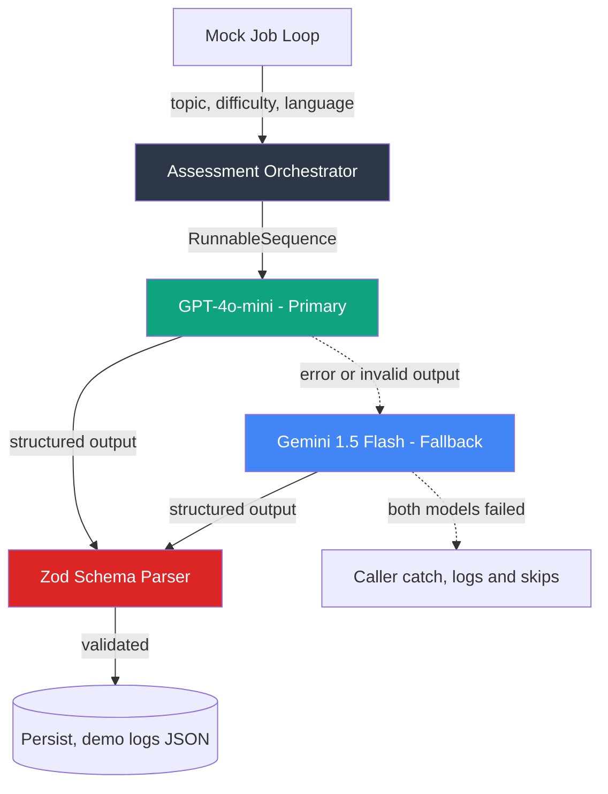

# LLM Orchestration

Generates multiple-choice questions from an LLM, validates them against a strict Zod schema, and fails over from OpenAI to Gemini when the primary model breaks.

Code: [github.com/sudhanshu1402/llm-assessment-pipeline](https://github.com/sudhanshu1402/llm-assessment-pipeline)

## The problem

LLM APIs fail on a normal Tuesday. Rate limits, timeouts, and output that's almost-but-not-quite valid JSON. Two consequences follow, and they need different answers.

One provider means one outage stops the feature. That's an availability problem, solved with a second provider.

Almost-valid output is worse, because it succeeds. A question with zero correct answers, or three, parses as JSON and stores cleanly and is discovered by a candidate sitting an assessment. That's a correctness problem, and it's solved by refusing to accept the shape, not by retrying.

## Architecture



The failover and the schema validation are real. The job queue is a mock in-process loop and persistence is a console log. Point it at a real queue like the [Distributed Queue Engine](/queue-engine) and a database to run it for real.

## The schema comes first

`src/schema.ts` is written before the prompt, and `StructuredOutputParser` derives the prompt's format instructions from it. One definition produces both the instruction sent to the model and the validation applied to its answer, so they can't drift apart. They drift immediately when the format is described in prose in a prompt template and enforced separately in code.

The shape:

```typescript
{
  questionText: string,       // min 10 chars
  options: [                  // exactly 4, exactly one isCorrect: true
    { id: string, text: string, isCorrect: boolean }, // x4
  ],
  explanation: string,
  difficulty: "beginner" | "intermediate" | "advanced",
  language: string            // locale code
}
```

The `.refine()` on exactly one correct option is the assertion that earns its place. Type-level validation gets you four options with boolean flags; it can't express "precisely one of these is true", and that's the failure mode a model actually produces. Wording varies per generation. The shape doesn't, because the parser won't allow it.

## The decisions, and what they cost

**Sequential failover, not parallel consensus.** `generateQuestion()` invokes the primary chain inside a `try`; on any throw it builds a second chain against Gemini and re-runs with identical inputs. Only one model's output is ever returned. Running both and comparing would catch more subtle quality problems and would also double cost on every single generation, add a merge policy nobody asked for, and make latency the max of two providers instead of the min. Sequential pays the second cost only when the first fails.

**A different vendor for the fallback, on purpose.** A second OpenAI model shares an incident with the first. Gemini doesn't.

**Validation on both paths.** The fallback output goes through the same parser. A fallback that skips validation to "at least return something" is how the correctness problem re-enters through the availability fix.

**Both failing propagates to the caller.** No default question, no partial save. The orchestrator's job is to produce a valid question or nothing.

## Failure modes

| What breaks | What happens |
|---|---|
| Primary rate-limited or times out | same inputs re-run against Gemini |
| Primary returns malformed JSON | parse throws, treated as failure, falls over |
| Model emits zero or three correct options | rejected by `.refine()`, nothing stored |
| Difficulty outside the enum | rejected; the enum is case-sensitive |
| Both providers fail | error reaches the caller, which logs and skips the job |

## Where this stops working

- **Jobs run sequentially.** Throughput needs real workers.
- **No caching**, so two near-identical topics each cost a full generation.
- **No cost tracking.** Token usage per generation is recorded nowhere, which is the first thing that matters once this runs at volume.
- **Both models failing just logs and skips.** A production worker needs a dead-letter queue.
- **No streaming**, so a long generation blocks until complete.
- **Console logging only.** Per-generation tracing would come from [Distributed Observability](/tracing-sdk).

## Test surface

No API keys and no network, because every LLM dependency is mocked. `schema.test.ts` hits the validation boundaries including the exactly-one-correct refinement and the case-sensitive difficulty enum. `pipeline.test.ts` stubs `RunnableSequence.from` to control each chain, then asserts three things: primary success never touches the fallback, a primary throw reaches Gemini with the same inputs, and both failing propagates. Those three cover the entire failover contract, which is the part worth trusting.
