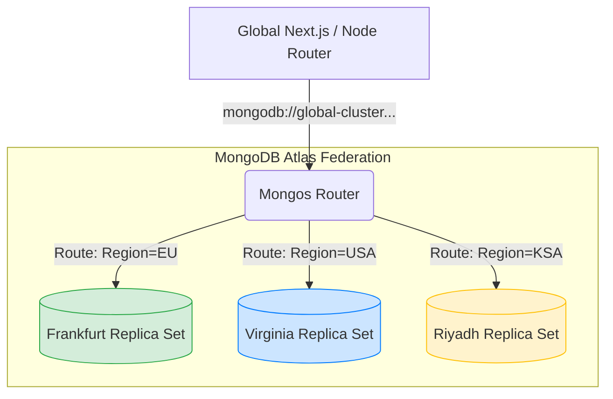

# Multi-Region Data Residency

A MongoDB implementation designed for stringent compliance environments (like GDPR), utilizing Atlas Zone Sharding to force geographical data localization while presenting a single cohesive connection string to the application.

## Global Sharding Topology

## Architecture Principles

### Compound Shard Keys & Tag Ranges
The application architecture avoids the "scatter-gather" problem by implementing a compound index: `{ region: 1, tenantId: 1 }`. MongoDB Atlas routes the documents using the `region` prefix. Tag zones are mapped natively to the hardware layer:
- `EU` tags reside strictly on European servers.
- `USA` tags reside strictly on American servers.

### Mongoose Connection Strategy
The application initializes a connection with `readPreference: 'nearest'`. This ensures that read queries are always routed to the geographically closest node in the replica set by latency, significantly improving edge read performance globally.

### Model-Level Routing Enforcement
Instead of maintaining multiple connection strings for different global instances, the codebase enforces the `region` directly in the Mongoose Model. The developer experience remains simple (`Tenant.create({ region: 'EU' })`), but the underlying BSON B-Tree forces the data to reside legally exactly where it belongs.
