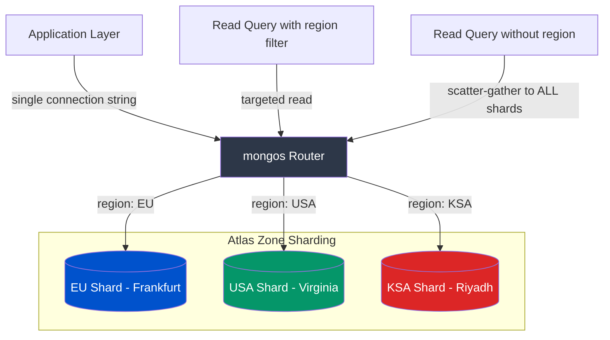

# Multi-Region Sharding

MongoDB Atlas zone-sharding patterns for data residency. Tenant data is physically pinned to its legal jurisdiction while the application still sees one connection string.

Code: [github.com/sudhanshu1402/multi-region-mongo-patterns](https://github.com/sudhanshu1402/multi-region-mongo-patterns)

## The problem

GDPR Article 44 and laws like Saudi PDPL say a resident's personal data stays inside a geographic boundary. The obvious implementation is a cluster per region, and it's expensive in the way that shows up months later: a connection string per region in every service, cross-region joins that can't happen in the database, and three times the operational surface for backups, upgrades and monitoring.

Zone sharding puts the boundary in the data layer instead. One logical cluster, one connection string, documents pinned to region-specific replica sets by their shard key. The application writes normally and Atlas decides which country the bytes land in.

What is in the repository is the schemas, the compound shard keys and the query patterns. Zone routing only actually happens on a real Atlas cluster with zones configured; locally a single MongoDB instance stands in for the topology. It's a patterns reference, not a compliance product.

## Architecture


```mermaid
graph TB
    App[Application Layer] -->|single connection string| Mongos[mongos Router]
    Mongos -->|region: EU| EU[(EU Shard - Frankfurt)]
    Mongos -->|region: USA| USA[(USA Shard - Virginia)]
    Mongos -->|region: KSA| KSA[(KSA Shard - Riyadh)]

    App2[Read Query with region filter] -->|targeted read| Mongos
    App3[Read Query without region] -->|scatter-gather to ALL shards| Mongos

    subgraph "Atlas Zone Sharding"
        EU
        USA
        KSA
    end

    style Mongos fill:#2d3748,color:#fff
    style EU fill:#0052cc,color:#fff
    style USA fill:#059669,color:#fff
    style KSA fill:#dc2626,color:#fff
```

## The shard key is the whole design

`{ region: 1, tenantId: 1 }`, in that order.

The prefix is what `mongos` uses to route. With `region` first, a write or a filtered read touches exactly one shard, and the tag ranges below map each region value to hardware in that jurisdiction. Reverse the order and `tenantId` leads: every query that doesn't also pin the region becomes a scatter-gather across all three continents, and the residency guarantee stops being a routing property and becomes a promise in a design document.

Cluster setup runs once:

```javascript
sh.shardCollection("global_db.tenants", { "region": 1, "tenantId": 1 })
sh.addTagRange("global_db.tenants",
  { "region": "EU", "tenantId": MinKey },
  { "region": "EU", "tenantId": MaxKey },
  "EU_ZONE")
// repeat for USA_ZONE and KSA_ZONE
```

## Query routing

| Query | Routing |
|---|---|
| `User.find({ region: "EU", tenantId: "t1" })` | targeted, EU shard only |
| `User.find({ tenantId: "t1" })` | scatter-gather across all three |
| `User.find({ region: "EU" }).read("nearest")` | targeted, nearest replica |

Always include `region`. That's the entire discipline this pattern asks of application code, and it's the thing to put in a code review checklist, because a missing `region` is a correct-looking query that quietly costs three shards.

## The decisions, and what they cost

**Region denormalized onto both Tenant and User.** The tenant already knows its region, so storing it again on the user is redundant data that can, in principle, disagree with itself. The alternative is a lookup into `tenants` before every user query just to learn which shard the user is allowed to be on: a cross-shard read to route a read. The redundancy is the cheaper correctness problem, and it's contained by enforcing the invariant at write time.

**Residency enforced at write time, not by convention.** `POST /users` returns 409 if the user's region doesn't match its tenant's zone, and 404 if the tenant doesn't exist. This is what keeps the denormalized copy honest: a record can't physically land in a zone that violates its tenant's residency, so the two copies can't drift.

**`nearest` read preference, with a strict fallback.** Reads go to the lowest-latency member, which is the point of having replicas in-region. `resolveReadPreference` falls back to `nearest` on any typo or wrong case rather than throwing, so a malformed config degrades to a sane default instead of taking reads down.

**Three regions as an enum.** Hardcoded, deliberately. Adding APAC is one enum value plus an Atlas zone tag, and the compile error tells you every place that needs to know.

## Failure modes

| Situation | Behaviour |
|---|---|
| User region mismatches tenant zone | 409 at write, nothing stored |
| Unknown tenant | 404 |
| Read preference misconfigured | falls back to `nearest` |
| Query omits `region` | succeeds, but scatter-gathers every shard |
| One region's shard unavailable | that region's traffic fails; other regions keep serving |

The last two rows are the interesting ones. Omitting `region` is a performance and cost failure that no test will catch for you, and per-region isolation is a benefit and a limitation at once: EU stays up when Virginia doesn't, and nothing can serve EU data from Virginia even if you want it to.

## Where this stops working

- **No tenant migration tooling.** Moving a tenant between regions is manual and downtime-shaped.
- **Cross-region analytics is scatter-gather by definition.** The real answer is CDC into a separate reporting cluster.
- **Compliance checks are application-level.** No MongoDB audit log is wired up.
- **No chunk pre-splitting**, so onboarding one enormous tenant distributes badly at first.

## Test surface

Everything verifiable without a cluster: the residency guard across all four outcomes, `resolveReadPreference` including wrong case and typos, and Mongoose schema validation plus the region-leading compound index on both models. `validateSync()` means no database connection is needed, so the shard key order itself is asserted in CI.
