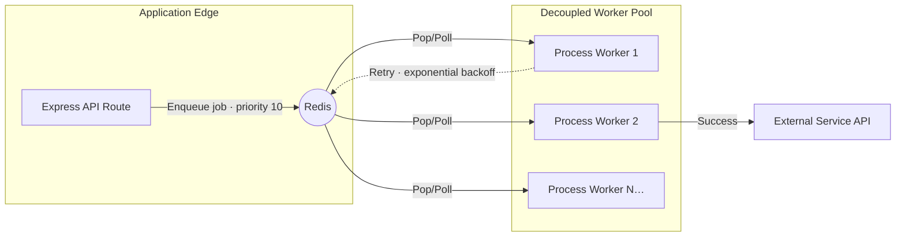

# Distributed Queue Engine

A highly resilient, horizontal background processing orchestration layer backed by Redis and BullMQ, designed to offload heavy I/O workloads from the Edge API.

## Worker Architecture

## System Resiliency Measures

### Vertical & Horizontal Scaling
The API servers and Worker processes are explicitly separated into different entry points (`api/index.ts` vs `worker/index.ts`). This allows DevOps engineers to scale the API cluster dynamically based on HTTP traffic, while independently scaling the Worker cluster based on Queue depth metrics.

### CROSSSLOT-Safe Keys via Redis Hash Tags
Queue keys are defined using `{}` hash tags (e.g., `{emails}:outbound`). This forces all internal sorted sets, lists, and metadata keys belonging to a specific BullMQ instance onto the exact same hash slot within a Redis Cluster, preventing cross-node `CROSSSLOT` transaction errors.

### Exponential Backoff Safety Nets
Jobs simulating arbitrary external SMTP failures are returned to the queue and delayed using `type: 'exponential'`. This protects external API limits and auto-heals transient network stutters, ultimately moving chronically failing jobs to BullMQ's failed set (its dead-letter equivalent).
