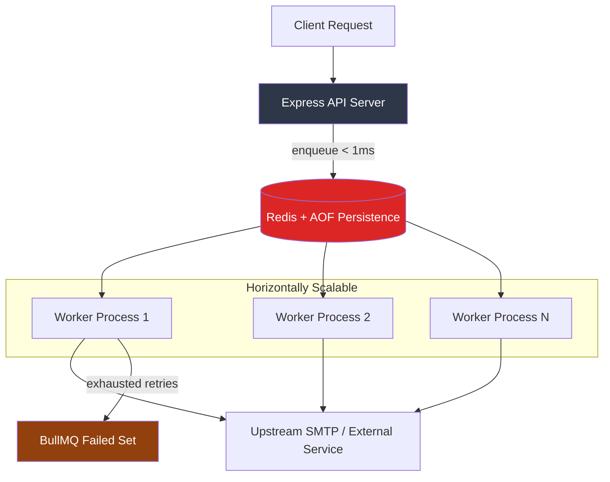

# Distributed Queue Engine

A Redis and BullMQ job engine that gets slow I/O off the request path. The API enqueues and returns; separate worker processes do the slow part on their own schedule and their own machines.

Code: [github.com/sudhanshu1402/distributed-queue-engine](https://github.com/sudhanshu1402/distributed-queue-engine)

## The problem, stated as a number

A password-reset email that takes 2s holds an HTTP connection open for 2s. At 50 concurrent resets that's 50 connections doing nothing but waiting on someone else's SMTP server. p99 follows the slowest dependency, and a provider having a bad afternoon becomes an API having a bad afternoon.

Enqueueing costs one Redis write. The API answers in under a millisecond with `202` and a job id, and the slow work moves to a pool you can scale on queue depth instead of on HTTP traffic.

## Architecture



`src/api` and `src/worker` are separate entry points. They share the queue definition and the Redis config and nothing else, which is what makes them separate processes in development and separate containers in production.

## What happens to one job

1. `POST /api/users/reset-password` hands the payload to the producer.
2. The producer calls `queue.add` on `{emails}:outbound` with a priority and a retry policy, then the route returns `202` with the job id.
3. A worker in the pool pops the job and runs the processor.
4. Success ends the job. A throw schedules attempt two, delayed by backoff.
5. Three failed attempts move the job to BullMQ's failed set, which is its dead-letter equivalent.

The processor fails about 20% of the time on purpose. `createEmailProcessor` is a `setTimeout` plus a seeded random failure, so retries, priority routing and scaling can all be exercised without a live SMTP account. Swapping in a real send doesn't change any of the plumbing around it.

## The decisions, and what they cost

**Hash-tagged queue names.** The queue is `{emails}:outbound`, not `emails:outbound`. BullMQ's internals are multi-key Lua scripts across sorted sets, lists and hashes; in a Redis Cluster those keys must live on one hash slot or the scripts fail with `CROSSSLOT`. The braces force the slot. On a single node this buys nothing today. It means moving to Cluster later is a config change rather than a rename of every key in a live queue.

**Two entry points instead of one process with a flag.** A single process that serves HTTP and drains jobs is less code and one deploy. It also means an API scaled for a traffic spike scales the worker pool with it, and a worker that wedges takes the HTTP listener down with it. Separate `CMD`s from one image was the trade: slightly more deploy surface, independent failure and independent scaling.

**Priority as an integer, not a second queue.** Password resets enqueue at priority 1, everything else at 10, and BullMQ's sorted set drains low numbers first. A separate high-priority queue would give stronger isolation and would also need its own workers, its own metrics, and a decision about what to do when one is empty and the other is deep. The integer is the cheaper 90% answer.

**Injectable clock and RNG in the processor.** The reason the test suite needs no Redis and no network. Tests assert the exact options passed to `queue.add`, both branches of the processor, and clean shutdown on `SIGINT` and `SIGTERM`.

## Failure modes

| What breaks | What happens | Why |
|---|---|---|
| Upstream SMTP flakes | 3 attempts at 5s, 10s, 20s, then the failed set | exponential backoff protects the provider's rate limit and rides out a stutter |
| Worker crashes mid-job | job returns to the queue | BullMQ stalled-job recovery |
| Redis restarts | queue replays | AOF persistence is on in the compose file |
| API crashes | nothing stops | workers hold their own Redis connections |
| Rolling deploy | in-flight jobs drain | `SIGINT` and `SIGTERM` call `worker.close()` before exit |
| Retries exhausted | job sits in the failed set | nothing consumes it, see the ceiling below |

## Where this stops working

Honest ceilings, in the order they would bite:

- **One Redis node.** No Sentinel, no Cluster. Redis is the single point of failure for the whole queue.
- **No backpressure.** A rate-limited downstream needs BullMQ's limiter; today workers will happily hammer it.
- **Nobody reads the failed set.** Dead letters accumulate silently. The first real production need is an alert on its depth.
- **No job deduplication.** A retry after a partial success can double-send. Idempotency keys on the send are the fix.
- **Console logs only.** Tracing a request from HTTP through enqueue to worker needs the wiring in [Distributed Observability](/tracing-sdk).

## Running it

Redis with AOF comes up in Docker, then the two processes come up separately, which is the point.

```bash
docker-compose up -d
npm run api:dev
npm run worker:dev
```

The worker logs every pickup, completion and failure, so the 20% failure rate makes backoff and dead-lettering visible within a minute of watching it.
