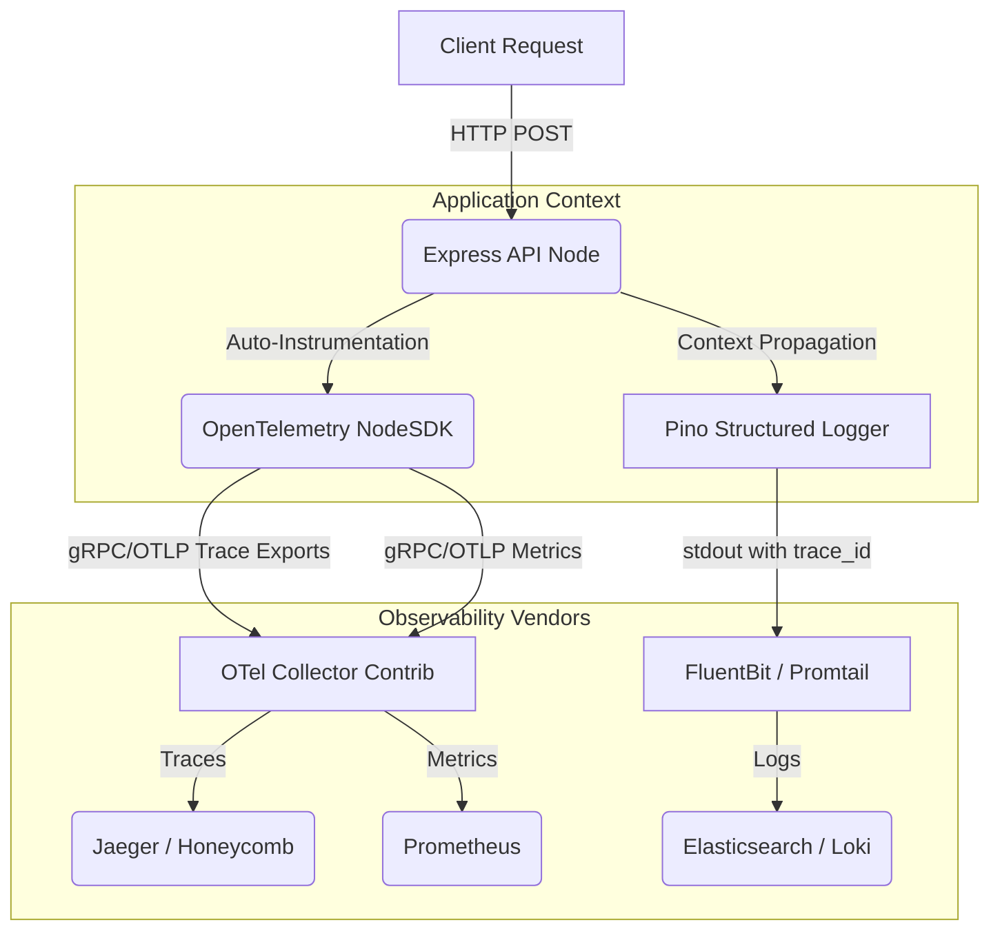

# OpenTelemetry SDK Node

A production-ready `NodeSDK` wrapper for OpenTelemetry, enabling end-to-end distributed tracing across microservices with Zero-Code instrumentation injection.

## System Architecture



## Key Engineering Decisions

### 1. Zero-Code Auto Instrumentation
Rather than manually creating spans recursively, this architecture utilizes `@opentelemetry/auto-instrumentations-node`. This hooks directly into the Node.js `diagnostics_channel` and patches standard libraries (`fs`, `http`, `pg`, `redis`) to automatically generate spans.

### 2. Log Correlation Pipeline
Traces are useless without context. The custom `pino` logger implementation automatically reads the active `SpanContext` from the OpenTelemetry API and injects `trace_id` and `span_id` directly into the JSON log payload.

```typescript
// Seamless Context Extraction inside Pino Log Hook
const spanContext = opentelemetry.trace.getSpanContext(opentelemetry.context.active());
if (spanContext) {
  logObject.trace_id = spanContext.traceId;
  logObject.span_id = spanContext.spanId;
}
```

### 3. Vendor Agnostic Collection
By routing all signals to a local `otel-collector-contrib` instance over gRPC, the Node application is entirely decoupled from the underlying vendor (e.g. Datadog vs New Relic). The collector handles the authentication, batching, and routing independently.
