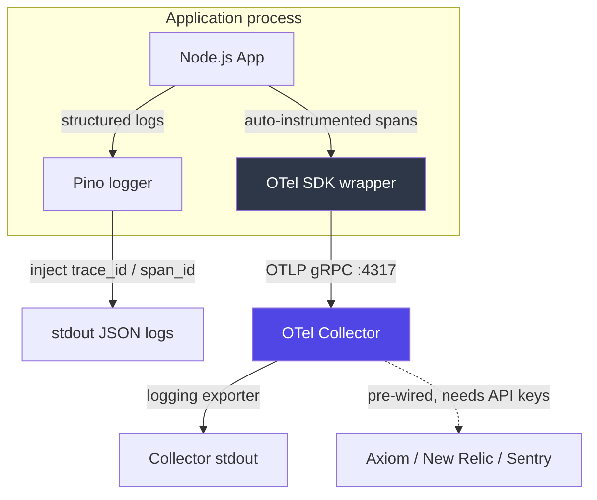

# Distributed Observability

OpenTelemetry wiring for Node services: OTLP/gRPC traces, Pino logs stamped with the trace they happened in, periodic metrics, and a shutdown that actually flushes.

Code: [github.com/sudhanshu1402/otel-sdk-node](https://github.com/sudhanshu1402/otel-sdk-node)

## The problem

One request crosses five services. Without trace propagation and correlated logs, debugging it means grepping five sets of container logs and hoping the timestamps line up. They usually don't, because clocks drift and log lines from the same request are minutes apart in wall time when a queue sits in the middle.

This is a thin configuration layer over the official `@opentelemetry/sdk-node`, not a reimplementation. The value is entirely in the wiring, which is the part that's easy to get subtly wrong and hard to notice you got wrong: everything appears to work, and some spans are simply missing.

## Architecture


```mermaid
graph TB
    App[Node.js App] -->|auto-instrumented spans| SDK[OTel SDK wrapper]
    App -->|structured logs| Logger[Pino logger]
    Logger -->|inject trace_id / span_id| Out[stdout JSON logs]
    SDK -->|OTLP gRPC :4317| Collector[OTel Collector]
    Collector -->|logging exporter| Stdout[Collector stdout]
    Collector -.->|pre-wired, needs API keys| Vendors[Axiom / New Relic / Sentry]

    subgraph "Application process"
        App
        SDK
        Logger
    end

    style SDK fill:#2d3748,color:#fff
    style Collector fill:#4f46e5,color:#fff
```

## Boot order is the whole trick

`initializeTelemetry()` runs at the very top of `src/index.ts`, before Express or anything else instrumented is imported.

Auto-instrumentation works by patching modules as they are required. Anything imported before `sdk.start()` gets the original, unpatched module, and its spans never exist. Nothing errors. No warning is printed. You get a trace with a hole in it exactly where your HTTP client used to be, and you spend an afternoon looking for the bug in your instrumentation config instead of in your import order.

This is the single highest-value thing to know about wiring OpenTelemetry into an existing service, and it's why the import sits alone at the top of the file with a comment rather than being tidied in with the others.

## Correlation as a pure function

Pino's `formatters.log` hook reads the active span context and adds `trace_id`, `span_id` and `trace_flags` to every log object:

```json
{ "level": 30, "msg": "Processing work inside span...",
  "trace_id": "a1b2c3d4e5f6a1b2c3d4e5f6a1b2c3d4",
  "span_id": "1234567890abcdef", "trace_flags": 1 }
```

The extraction lives in `withTraceContext`, separate from the logger construction. That separation is what makes it testable without a running SDK: given a context, it returns an object. The test suite covers passthrough when no span is active, injection when one is, immutability of the input, empty ids, and overwriting stale trace fields. That last case is what happens when a log object gets reused across spans.

One trace id now reconstructs the whole request path, and any log line links back to the span it happened in. That's the actual payoff: not the traces, the join between traces and logs.

## The decisions, and what they cost

**Auto-instrumentation over hand-rolled spans.** `@opentelemetry/auto-instrumentations-node` patches HTTP, database and queue clients, so coverage arrives without touching call sites. The cost is less control over span naming and attributes, and a dependency that decides what a span is. Custom spans are still available where a business operation deserves one. The demo app's `/` route opens one to show the pattern.

**A collector in the path instead of exporting to a vendor directly.** The application speaks OTLP to a local collector and knows nothing about the backend. Batching, retries, authentication and vendor routing are the collector's problem, and switching vendors is a collector config change with no application deploy. The cost is one more component to run.

**Shutdown flushes.** `SIGTERM` and `SIGINT` both call `sdk.shutdown()`. Without it, the last batch of spans dies with the process on every deploy, which is precisely the window where you most want traces.

## Failure modes

| What breaks | What happens |
|---|---|
| Something imported before `sdk.start()` | its spans silently don't exist |
| Collector down | exports fail; the application keeps serving |
| Deploy or rolling restart | final span batch is flushed by the shutdown hook |
| Log emitted outside any span | line is written with no trace fields, not dropped |
| High throughput | every span is exported, because sampling isn't configured |

## Where this stops working

- **100% of spans are exported.** Real throughput needs tail-based sampling in the collector, which is where the decision belongs, since the collector can see whether a trace had an error before deciding to keep it.
- **One collector container.** No HA, no DaemonSet or sidecar topology.
- **Vendor exporters are pre-wired but inactive.** Axiom, New Relic and Sentry exist in the collector config and need keys and a pipeline to ship anywhere real.
- **No baggage propagation**, so tenant id and feature flags don't cross service boundaries yet.

## Where it goes next

This drops into any Node service. Wiring it into the [Distributed Queue Engine](/queue-engine) gives one trace from HTTP request through enqueue to worker execution, which is the case that log grepping handles worst.
